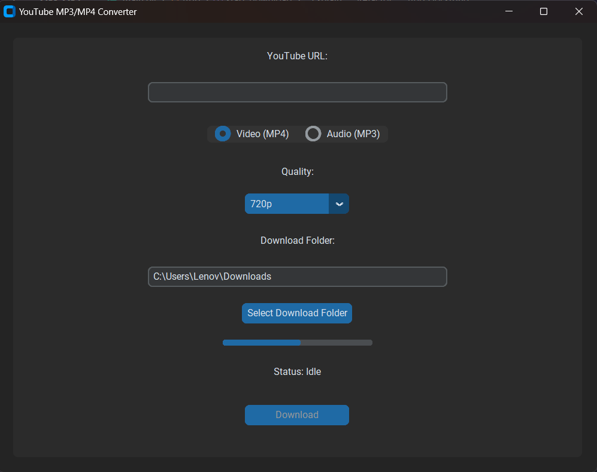

# YouTube MP3/MP4 Converter


A simple and elegant desktop application to download YouTube videos in MP4 or MP3 format, developed in Python.

## 🛠️ Technologies Used

- **Language:** Python 3.x
- **GUI Framework:** CustomTkinter
- **Main Libraries:**
  - `yt-dlp`: For YouTube downloading
  - `customtkinter`: For modern GUI interface
  - `threading`: For asynchronous download handling

## ✨ Features

- Modern GUI with CustomTkinter
- Download YouTube videos in MP4 format
- Extract audio in MP3 format
- Video quality selection (144p to 1080p)
- Real-time progress bar
- User-friendly interface
- **Select your own download folder**: Users can now choose where to save downloaded files.

## 📋 Prerequisites

- Python 3.x installed on your system
- Internet connection

## 🚀 Installation

1. Clone the repository:
```bash
git clone https://github.com/Ad2m1109/convertisseur_MP3_MP4.git
cd convertisseur_MP3_MP4
```

2. Install dependencies:
```bash
pip install -r requirements.txt
```

3. Ensure `ffmpeg` is installed and available in your system's PATH. You can download it from [FFmpeg](https://ffmpeg.org/download.html).

## 📦 Usage Instructions

1. Enter the YouTube URL in the provided field.
2. Select the desired format (MP3 or MP4).
3. Choose the quality of the download.
4. Click on "Select Download Folder" to choose where to save the downloaded files.
5. Click the "Download" button to start the download process.

Files will be saved in the selected download folder.

## 📁 Project Structure

```
convertisseur_MP3_MP4/
├── main.py              # Main program
├── requirements.txt     # Python dependencies
├── YouTubeConverter.spec # PyInstaller spec file
├── README.md            # Documentation
├── LICENSE              # MIT License
└── images/              # Directory for images and icons
    └── icon.ico         # Application icon
```

## 📝 License

This project is licensed under the MIT License - see the [LICENSE](LICENSE) file for details.

## 👨‍💻 Developer

- [@Ad2m1109](https://github.com/Ad2m1109)

## 📸 Application Interface

Here is a screenshot of the application interface:


